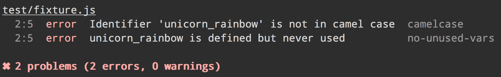

# gulp-xo [](https://travis-ci.org/xojs/gulp-xo)

> Validate files with [XO](https://github.com/xojs/xo)



*Issues regarding rules should be reported on the ESLint [issue tracker](https://github.com/eslint/eslint/issues) as it's the actual linter.*

## Install

```
$ npm install --save-dev gulp-xo
```

## Usage

```js
const gulp = require('gulp');
const xo = require('gulp-xo');

exports.default = () => (
	gulp.src('src/app.js')
		.pipe(xo())
		.pipe(xo.format())
		.pipe(xo.failAfterError())
);
```

## API

### xo(options?)

#### options

Type: `object`

Any additional options to the below are [passed directly to XO](https://github.com/xojs/xo/blob/master/readme.md#config). However, you should prefer setting your XO config in `package.json` so editors and other tools can also read it. Only pass them here if you want to use options different from those of your current project. You might want to do this if your Gulp task lints or builds files that are/will be part of a separate project.

##### fix

Type: `boolean`

This option instructs ESLint to try to fix as many issues as possible. The fixes are applied to the gulp stream. The fixed content can be saved to file using `gulp.dest` (See [example/fix.js](https://github.com/adametry/gulp-eslint/blob/master/example/fix.js)). Rules that are fixable can be found in ESLint's [rules list](http://eslint.org/docs/rules/).

When fixes are applied, a "fixed" property is set to `true` on the fixed file's ESLint result.

##### quiet

Type: `boolean`\
Default: `false`

Report errors only.

### [xo.format(formatter, output)](https://github.com/adametry/gulp-eslint/#eslintformatformatter-output)

### [xo.failAfterError()](https://github.com/adametry/gulp-eslint/#eslintfailaftererror)

### [xo.failOnError()](https://github.com/adametry/gulp-eslint/#eslintfailonerror)

### [xo.formatEach(formatter, output)](https://github.com/adametry/gulp-eslint/#eslintformateachformatter-output)

### [xo.result(action)](https://github.com/adametry/gulp-eslint/#eslintresultaction)

### [xo.results(action)](https://github.com/adametry/gulp-eslint/#eslintresultsaction)

## Related

- [gulp-eslint](https://github.com/adametry/gulp-eslint) - Gulp plugin for ESLint
- [gulp-reporter](https://github.com/gucong3000/gulp-reporter) - Error reporter for CSSLint, EditorConfig, ESLint, HTMLHint, PostCSS, TSLint, XO
